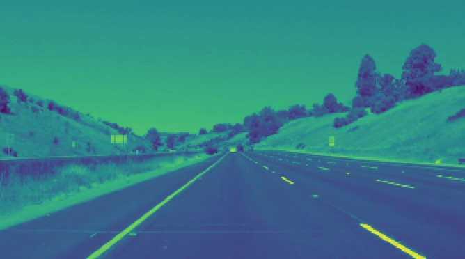
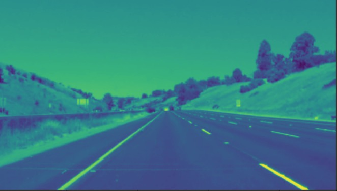
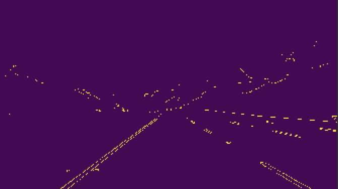
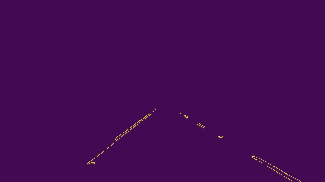
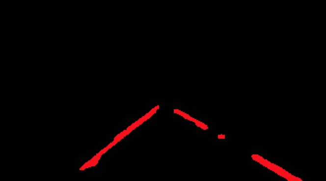
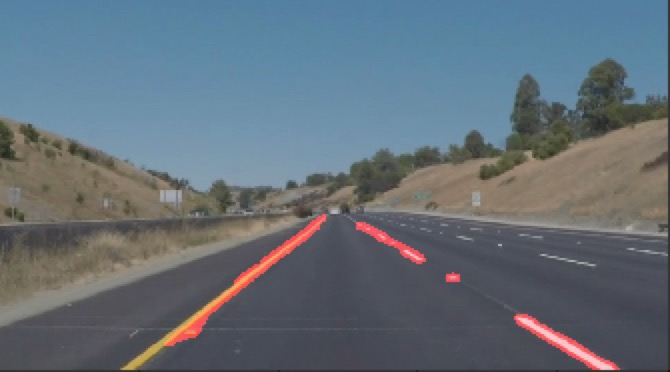

The Writeup
---
The goals / steps of this project are the following:
* Make a pipeline that finds lane lines on the road
* Reflect on your work in a written report

---

### Reflection

### 1. Describe your pipeline. As part of the description, explain how you modified the draw\_lines() function.

My pipeline consisted of 6 steps. First, I converted the images to `grayscale`, then I apply `Gaussian` smoothing the image, in order to reduce noise, actually, `Canny` applies Gaussian smoothing internally, but we include it here because you can get a different result by applying further smoothing. Canny function will find image edges, then we should  select interest region by  `mask`  image, next we connect the point  in the masked image use `HoughLinesP `,last merge origin image and 

In order to draw a single line on the left and right lanes, I modified the draw\_lines() function by thickness = 10.

If you'd like to include images to show how the pipeline works, here is show how the image change step by step:
*Gray:*

*Gaussian*

*Edged（Canny）*

*Mask*

*Hough*

*Merge*

---

### 2. Identify potential shortcomings with your current pipeline

One potential shortcoming would be what would happen when Lane Lines is curved or the lane lines‘ gap is big, the pipeline is not accuracy. 

### 3. Suggest possible improvements to your pipeline
According to the algorithms I learned  now, I have no idea how to big improve the pipeline, or maybe I have not understand these algorithms totally.  

